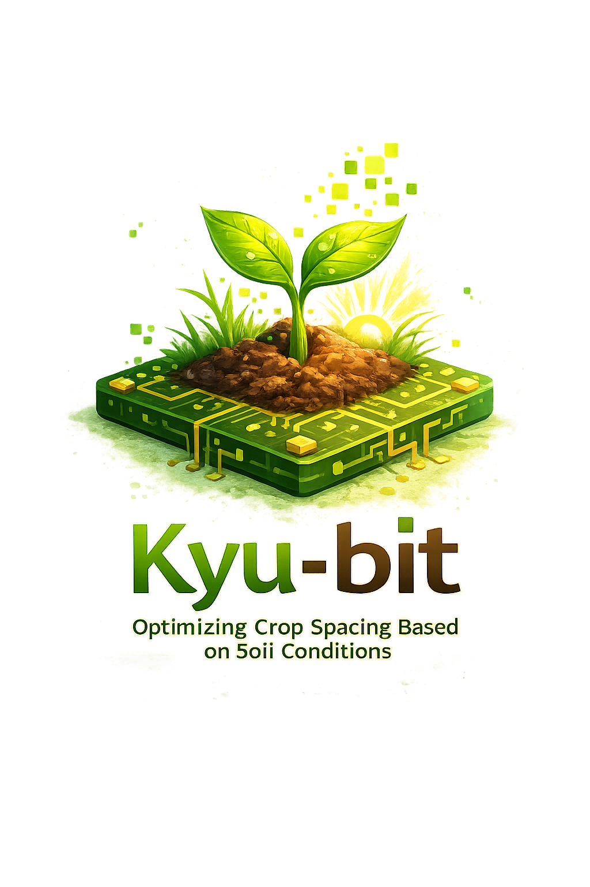

markdown

<div align="center">



# 🌾 Kyu-bit

### Optimizing Crop Spacing Based on Soil Conditions

**QUBO + Simulated Annealing 기반 농업 작물 배치 최적화 시스템**

[](https://python.org)
[](https://fastapi.tiangolo.com)
[](https://docs.ocean.dwavesys.com/en/stable/docs_neal/sdk_index.html)
[](LICENSE)

[📖 발표자료](QI4U%20in%20PNU%20-%20Group9.pdf) · [🚀 API 실행하기](#-quick-start) · [🌐 Web UI](#-web-ui--api)

</div>

---

## 📌 프로젝트 개요

> **"밭의 토양 상태를 고려하여, 작물을 어디에 얼마나 심어야 최적인가?"**

전통적인 농업에서는 **균일한 격자 간격**으로 작물을 심습니다.
하지만 실제 밭의 토양 비옥도는 위치마다 다릅니다.

**Kyu-bit**은 이 문제를 **양자 영감 최적화(Quantum-Inspired Optimization)** 로 해결합니다:

1. 밭을 격자로 나누고 각 위치에 **토양 비옥도 점수**를 부여
2. "어디에 심을까?"를 **이진 변수(0/1)** 로 모델링 → **QUBO 문제**로 변환
3. **Simulated Annealing**으로 최적 배치를 탐색
4. 결과를 **히트맵**으로 시각화

### 🎯 핵심 가치

|
 기존 방식 
|
 Kyu-bit 
|
|
-----------
|
---------
|
|
 균일 격자 배치 
|
 토양 상태 기반 
**
적응형 배치
**
|
|
 경험에 의존 
|
**
수학적 최적화
**
 (QUBO) 
|
|
 단일 작물만 고려 
|
**
12종 작물
**
 동시 비교 
|
|
 결과 확인 어려움 
|
**
웹 UI + API + 히트맵
**
 제공 
|

---

## 🧬 작동 원리
┌─────────────┐     ┌──────────────┐     ┌─────────────┐     ┌──────────────┐
│  📐 밭 크기  │ ──→ │  🌱 작물 선택  │ ──→ │  🧮 QUBO 생성 │ ──→ │  ⚡ SA 최적화  │
│  (가로×세로)  │     │  (12종 중 택1) │     │  (목적함수+   │     │  (D-Wave Neal │
│              │     │              │     │   제약조건)    │     │   Sampler)    │
└─────────────┘     └──────────────┘     └─────────────┘     └──────┬───────┘
│
┌──────────────┐     ┌─────────────┐            │
│  📊 결과 출력  │ ←── │  🗺️ 히트맵   │ ←──────────┘
│  (JSON/Web)  │     │  시각화      │
└──────────────┘     └─────────────┘


### QUBO 모델 구성

목적함수 = -(심은 수 보상) - (비옥도 가중치) + (간격 위반 페널티)

Q(i,i) = -(count_reward + fertility_weight × soil_score[i])   ← 대각항: 많이 심되, 좋은 땅 우선
Q(i,j) = +penalty    (if distance(i,j) < min_spacing)         ← 비대각항: 너무 가까우면 페널티


---

## 🌿 지원 작물 (12종)

| 작물 | 한국어 | 재식 간격 |
|------|--------|-----------|
| 🌾 Rice (Transplanted) | 벼 (이앙) | 30 × 14~15 cm |
| 🍠 Sweet Potato (Early) | 고구마 (조기) | 70~75 × 20 cm |
| 🍠 Sweet Potato (Late) | 고구마 (만기) | 75 × 25 cm |
| 🥬 Chinese Cabbage | 배추 | 60~70 × 30~40 cm |
| 🥕 Daikon Radish | 무 | 60 × 25~30 cm |
| 🥗 Lettuce | 상추 | 15~20 × 15~20 cm |
| 🧄 Garlic | 마늘 | 20 × 10 cm |
| 🧅 Onion | 양파 | 20~25 × 10 cm |
| 🥬 Japanese Long Onion | 대파 | 75~85 × 5 cm |
| 🌶️ Chili Pepper (Open) | 고추 (노지) | 100~110 × 35 cm |
| 🌶️ Chili Pepper (Guide 1R) | 고추 (1줄) | 90~100 × 35 cm |
| 🌶️ Chili Pepper (Guide 2R) | 고추 (2줄) | 150~160 × 35 cm |

---

## 📁 프로젝트 구조

Kyu-bit/
│
├── 📄 QI4U in PNU - Group9.pdf              ← 발표 자료
├── 🖼️ team_LOGO.png                         ← 팀 로고
├── 📂 QI4U_PNU_Group9_Kyu-bit/              ← 연구 코드 (원본)
├── 📂 QI4U_PNU_Group9_Kyu-bit_v1.0.../      ← 연구 코드 (v1.0)
│
└── 📂 api/                                   ← 🚀 API 서비스
├── main.py                               ← FastAPI 앱 초기화
├── crops_data.py                         ← 12종 작물 데이터
├── schemas.py                            ← Pydantic 요청/응답 모델
├── optimizer.py                          ← QUBO + SA 핵심 로직
├── requirements.txt                      ← 패키지 목록
├── routes/
│   ├── web.py                            ← 🖥️ Web UI (/)
│   ├── info.py                           ← 📋 /health, /api/crops
│   └── optimization.py                   ← 📦 /api/optimize/*
└── templates/
└── index.html                        ← 웹 UI HTML


### 서버 엔드포인트 구조

main.py 서버
├── /                    → 🖥️ 웹 UI (사람이 보는 예쁜 화면)
├── /docs                → 📋 Swagger (개발자용 API 테스트)
├── /api/crops           → 📦 JSON 데이터 (프로그램이 가져감)
├── /api/optimize/single → 📦 단일 작물 최적화 API
└── /api/optimize/all    → 📦 전체 작물 비교 API


---

## 🚀 Quick Start

### 1. 레포 클론

```bash
git clone https://github.com/leedongwon1/Kyu-bit.git
cd Kyu-bit/api
2. 가상환경 생성 & 활성화
bash

python -m venv venv

# Mac/Linux
source venv/bin/activate

# Windows
venv\Scripts\Activate
3. 패키지 설치
bash

pip install -r requirements.txt
4. 서버 실행
bash

uvicorn main:app --reload
5. 접속
URL	설명
http://localhost:8000	🖥️ 웹 UI
http://localhost:8000/docs	📋 Swagger API 문서
http://localhost:8000/api/crops	📦 작물 목록 JSON
🌐 Web UI & API
🖥️ 웹 UI — 작물 선택 & 최적화
밭 크기를 입력하고 작물을 선택하면, 최적 배치를 계산하고 히트맵으로 보여줍니다.

📊 최적화 결과 예시
고구마 (조기/보통) | 밭: 400 × 200 cm | 재식 간격: 70~75 × 20 cm

항목	값
Candidate Step	38 × 10 cm
Candidate Grid	10 × 20
Actual Number Planted	50 🌱
Reference Count (Simple Grid)	50
Best Energy	-456.889
📋 Swagger API
개발자는 /docs에서 모든 API를 직접 테스트할 수 있습니다.

🔌 API 사용 예시
단일 작물 최적화:

bash

curl -X POST http://localhost:8000/api/optimize/single \
  -H "Content-Type: application/json" \
  -d '{
    "length_cm": 400,
    "width_cm": 200,
    "crop_key": "sweet_potato_early"
  }'
전체 작물 비교:

bash

curl -X POST http://localhost:8000/api/optimize/all \
  -H "Content-Type: application/json" \
  -d '{
    "length_cm": 400,
    "width_cm": 200
  }'
작물 목록 조회:

bash

curl http://localhost:8000/api/crops
🛠️ 기술 스택
분류	기술	역할
Backend	FastAPI	웹 프레임워크 & REST API
Optimization	D-Wave Neal	Simulated Annealing 솔버
Modeling	QUBO	이차 비제약 이진 최적화 모델
Computation	NumPy	수치 계산 & 격자 생성
Visualization	Matplotlib	토양 히트맵 & 배치 시각화
Validation	Pydantic	요청/응답 데이터 검증
Deployment	Uvicorn + ngrok	ASGI 서버 & 외부 배포
🧪 성능 특성
항목	사양
최대 밭 크기	10,000 × 10,000 cm (100m × 100m)
최대 QUBO 변수	1,600개 (자동 해상도 조절)
SA 샘플링 횟수	1~1,000회 (기본 120)
지원 작물 수	12종
응답 시간	단일 작물 ~1초, 전체 비교 ~10초
📂 관련 자료
파일	설명
QI4U in PNU - Group9.pdf	📄 프로젝트 발표 자료
QI4U_PNU_Group9_Kyu-bit/	💻 연구 코드 (원본)
QI4U_PNU_Group9_Kyu-bit_v1.0.../	💻 연구 코드 (v1.0)
api/	🚀 API 서비스 코드
👥 Team
PNU Group 9 — Kyu-bit

역할	이름
개발 & 설계	이동원
📄 License
This project is licensed under the MIT License — see the LICENSE file for details.

⚛️ Quantum-Inspired Optimization for Smart Agriculture

Kyu-bit — 양자 영감 알고리즘으로 더 똑똑한 농업을

```
